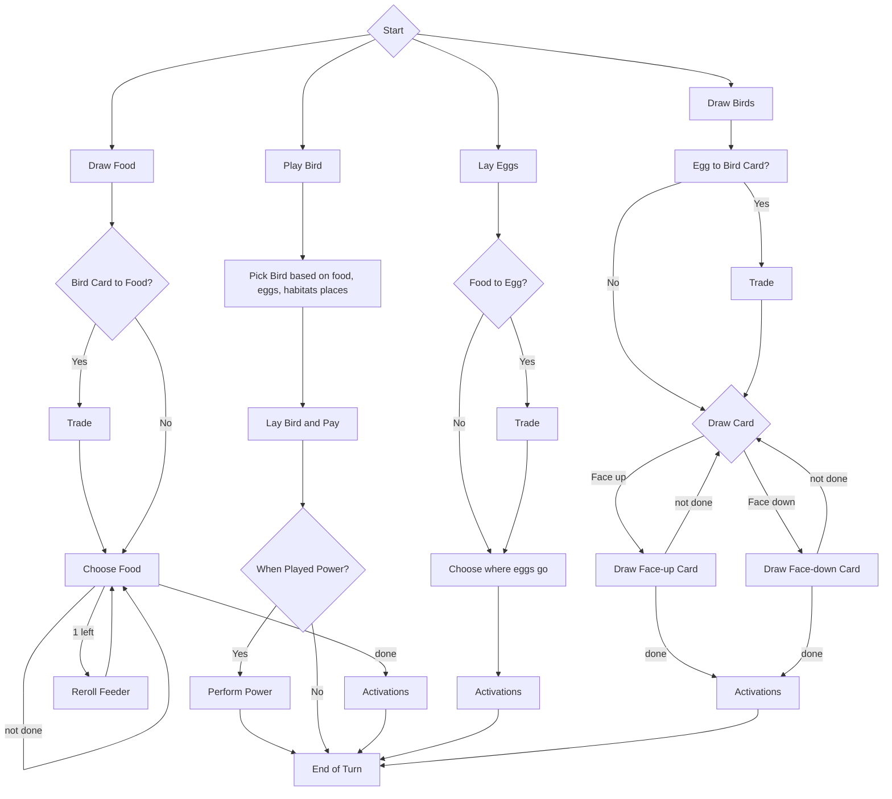

```mermaid
graph TD
    Start{Start} --> PlayBird[Play Bird]
    Start --> DrawFood[Draw Food]
    Start --> LayEggs[Lay Eggs]
    Start --> DrawBirds[Draw Birds]
    
    PlayBird --> PickBird[Pick Bird based on food, eggs, habitats places]
    PickBird --> LayBirdAndPay[Lay Bird and Pay]
    LayBirdAndPay --> WhenPlayedPower?{When Played Power?}
    WhenPlayedPower? -- Yes --> PerformPower[Perform Power]
    PerformPower --> EndTurn
    WhenPlayedPower? -- No --> EndTurn[End of Turn]
    
    DrawFood --> BirdCardToFood?{Bird Card to Food?}
    BirdCardToFood? -- Yes --> Trade1[Trade]
    Trade1 --> ChooseFood[Choose Food]
    BirdCardToFood? -- No --> ChooseFood
    ChooseFood -- not done --> ChooseFood
    ChooseFood -- 1 left --> RerollFeeder[Reroll Feeder]
    RerollFeeder --> ChooseFood
    ChooseFood -- done --> Activations1[Activations]
    Activations1 --> EndTurn
    
    LayEggs --> FoodToEgg?{Food to Egg?}
    FoodToEgg? -- Yes --> Trade2[Trade]
    FoodToEgg? -- No --> ChooseWhereEggsGo[Choose where eggs go]
    Trade2 --> ChooseWhereEggsGo
    ChooseWhereEggsGo --> Activations2[Activations]
    Activations2 --> EndTurn
    
    DrawBirds --> EggToBirdCard?[Egg to Bird Card?]
    EggToBirdCard? -- Yes --> Trade3[Trade]
    EggToBirdCard? -- No --> DrawBirdCard{Draw Card}
    Trade3 --> DrawBirdCard
    DrawBirdCard -- Face up --> DrawFaceupCard[Draw Face-up Card]
    DrawBirdCard -- Face down --> DrawFaceDownCard[Draw Face-down Card]
    DrawFaceupCard -- not done --> DrawBirdCard
    DrawFaceDownCard -- not done --> DrawBirdCard
    DrawFaceupCard -- done --> Activations3[Activations]
    DrawFaceDownCard -- done --> Activations3
    Activations3 --> EndTurn
```
