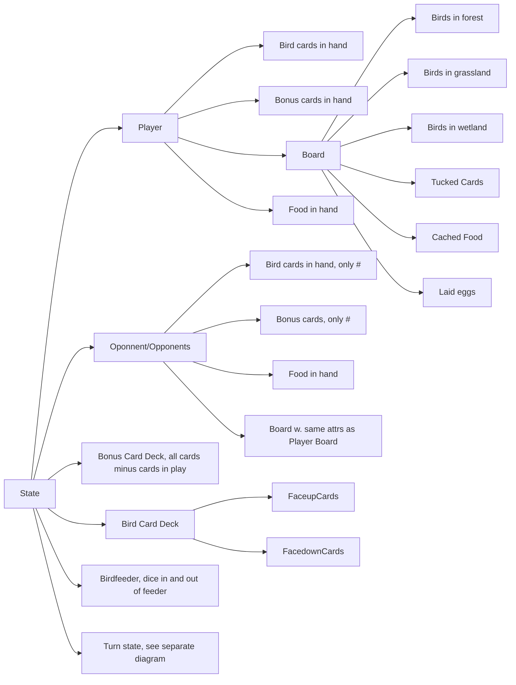

```mermaid
flowchart LR
State --> Player
State --> Opponent[Oponnent/Opponents]
State --> BonusCardDeck[Bonus Card Deck, all cards minus cards in play]
State --> BirdCardDeck[Bird Card Deck]
State --> Birdfeeder[Birdfeeder, dice in and out of feeder]
State --> TurnState[Turn state, see separate diagram]

Player --> BirdCards1[Bird cards in hand]
Player --> BonusCards1[Bonus cards in hand]
Player --> Board1[Board]
Player --> Food1[Food in hand]
Board1 --> ForestBirds1[Birds in forest]
Board1 --> GrasslandBirds1[Birds in grassland]
Board1 --> WetlandBirds1[Birds in wetland]
Board1 --> TuckedCards1[Tucked Cards]
Board1 --> CachedFood1[Cached Food]
Board1 --> Eggs1[Laid eggs]

Opponent --> BirdsCards2[Bird cards in hand, only #]
Opponent --> BonusCards2[Bonus cards, only #]
Opponent --> Food2[Food in hand]
Opponent --> Board2[Board w. same attrs as Player Board]

BirdCardDeck --> FaceupCards
BirdCardDeck --> FacedownCards
```
